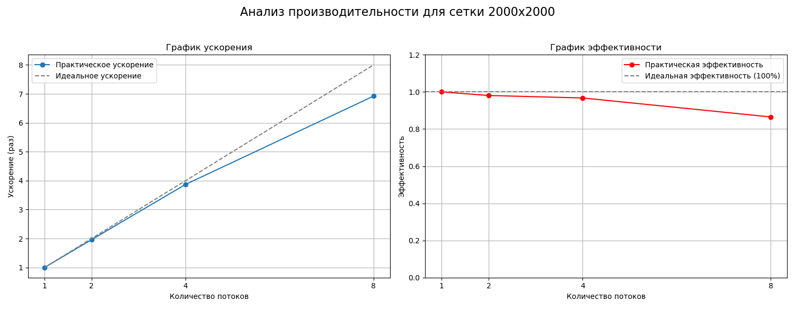

# Отчет по лабораторной работе №2

## Отчет по Заданию 1: Параллельное вычисление множества Мандельброта

### 1. Постановка задачи

Целью работы являлась разработка и исследование производительности параллельного алгоритма для вычисления множества Мандельброта с использованием технологии OpenMP. Задача заключалась в распараллеливании вычислительно интенсивного цикла проверки точек комплексной плоскости, а также в анализе масштабируемости полученного решения путем измерения ускорения и эффективности при разном количестве потоков и для различных размеров сетки.

### 2. Детали реализации и пояснения к коду

Алгоритм реализован на языке C с использованием библиотеки OpenMP.

**Основная логика вычислений:**
Программа итерируется по двумерной сетке комплексных чисел. Для каждой точки `c` выполняется итерационная проверка `z_n+1 = z_n^2 + c`, начиная с `z_0 = 0`. Если модуль комплексного числа `z` не превышает 2 после заданного максимального числа итераций (`max_iter`), точка считается принадлежащей множеству.

**Стратегия распараллеливания:**

1.  **Параллельная область и распределение нагрузки:**
    Наиболее затратная часть - двойной цикл по сетке - обернута в директивы OpenMP:
    ```c
    #pragma omp parallel
    {
        // ... создание локальных буферов ...
        #pragma omp for collapse(2) schedule(dynamic, chunk)
        for (size_t i = 0; i < npoints_side; ++i) {
            for (size_t j = 0; j < npoints_side; ++j) {
                // ... вычисления для одной точки ...
            }
        }
        // ... сбор результатов ...
    }
    ```
    *   `#pragma omp parallel`: Создает группу потоков, которые будут совместно выполнять код внутри блока.
    *   `#pragma omp for collapse(2)`: "Сжимает" два вложенных цикла в один большой, позволяя OpenMP более эффективно распределять итерации (в данном случае, точки сетки) между потоками.
    *   `schedule(dynamic, chunk)`: Выбрана динамическая стратегия планирования. Это ключевое решение, поскольку время вычисления для разных точек сильно варьируется. Точки, далекие от множества, отбрасываются за несколько итераций, тогда как точки на границе требуют всех `max_iter` итераций. Динамическое планирование позволяет потоку, завершившему свою порцию работы (`chunk`), немедленно взять следующую доступную, обеспечивая равномерную загрузку всех ядер.

2.  **Сбор результатов без гонки данных:**
    Для исключения конфликтов при одновременной записи в общий массив из нескольких потоков была применена стратегия с локальными буферами.
    *   Каждый поток накапливает найденные точки в своем приватном буфере (`local_buf`).
    *   Когда вычисления завершены, каждый поток атомарно "резервирует" себе место в общем массиве `mandelbrot_points`, используя директиву `#pragma omp atomic capture`. Эта операция потокобезопасно считывает текущий размер массива и увеличивает его на количество найденных точек в данном потоке.
    *   После этого поток копирует данные из своего локального буфера в выделенный ему уникальный сегмент глобального массива. Этот подход минимизирует накладные расходы на синхронизацию, сводя их к одной быстрой атомарной операции на поток.

### 3. Методика тестирования

*   **Аппаратная архитектура и среда:** Замеры производительности проводились на виртуальной машине **Virtual Box** с гостевой ОС **Ubuntu 24 (x86_64)**, запущенной на хостовой системе **Windows 10 (x86_64)**. Виртуальной машине было выделено 8 процессорных ядер. Процессор: AMD Radeon FX 8350
*   **Задача:** Вычисление множества Мандельброта с `max_iter = 1000` для трех сеток разного размера: **500x500, 1000x1000 и 2000x2000**.
*   **Измерение времени:** Время выполнения измерялось только для параллельной части программы (блок `#pragma omp parallel`) с помощью функции `omp_get_wtime()`. Для получения стабильных результатов программа запускалась для каждого набора параметров (число потоков, размер сетки) несколько раз, и для анализа бралось **минимальное время выполнения**, чтобы исключить влияние фоновых процессов операционной системы.
*   **Анализируемые метрики:**
    *   **Ускорение (Speedup):** `S(p) = T(1) / T(p)`, где `T(1)` - время выполнения на одном потоке, `T(p)` - время на `p` потоках.
    *   **Эффективность (Efficiency):** `E(p) = S(p) / p`. Показывает, насколько хорошо используются выделенные процессорные ресурсы. Идеальное значение - 1 (или 100%).

### 4. Результаты и анализ графиков

На всех трех наборах графиков (для сеток 500x500, 1000x1000 и 2000x2000) наблюдаются очень схожие тенденции.

**График ускорения (слева):**

*   **Наблюдения:** Практическое ускорение (синяя линия) растет почти линейно и очень близко следует за идеальным ускорением (серая пунктирная линия), особенно на 2 и 4 потоках. На 8 потоках наблюдается небольшое, но заметное отклонение от идеальной диагонали. Например, для сетки 2000x2000 ускорение на 8 потоках достигает почти 7, что является отличным результатом.
*   **Анализ:** Это говорит о высокой степени параллелизма в задаче и эффективности выбранной реализации. Задача отлично масштабируется. Небольшое отставание от идеала на 8 потоках является ожидаемым и объясняется **параллельными накладными расходами**:
    1.  **Затраты на синхронизацию:** Атомарные операции и неявная барьерная синхронизация в конце цикла `omp for`.
    2.  **Неидеальная балансировка нагрузки:** Даже при динамическом планировании возможны минимальные простои потоков в конце вычислений.
    3.  **Конкуренция за общие ресурсы:** Все 8 ядер конкурируют за доступ к общей кэш-памяти и оперативной памяти, что может приводить к небольшим задержкам.

**График эффективности (справа):**

*   **Наблюдения:** Эффективность (красная линия) предсказуемо снижается с ростом числа потоков, но остается на очень высоком уровне. Даже на 8 потоках она составляет около 85-87% (например, для сетки 2000x2000 ускорение ~6.9, эффективность 6.9/8 ≈ 0.86).
*   **Анализ:** Падение эффективности является обратной стороной роста накладных расходов. Чем больше потоков, тем большую долю от общего времени занимают синхронизация и управление ими. Тем не менее, эффективность выше 85% на 8 ядрах свидетельствует о превосходной реализации.

**Сравнение результатов для разных сеток:**

Форма графиков практически идентична для всех трех размеров сетки. Это говорит о том, что **гранулярность задачи** (соотношение объема вычислений к объему синхронизаций) достаточно высока даже для сетки 500x500. При увеличении размера сетки (например, до 2000x2000) объем вычислений на каждый поток растет, а накладные расходы остаются примерно теми же. В теории это должно приводить к чуть более высокой эффективности на больших сетках. Графики подтверждают, что эффективность не падает, а остается стабильно высокой, что указывает на надежность и хорошую масштабируемость алгоритма в широком диапазоне входных данных.

### 5. Выводы

1.  **Высокая эффективность реализации:** Применение технологии OpenMP в сочетании с продуманной стратегией (`collapse(2)`, `schedule(dynamic)` и локальные буферы) позволило создать высокоэффективное параллельное решение для вычисления множества Мандельброта.
2.  **Отличная масштабируемость:** Программа демонстрирует почти линейное ускорение и высокую эффективность (более 85%) вплоть до 8 потоков, что соответствует количеству выделенных ядер. Это подтверждает, что задача является тривиально распараллеливаемой.
3.  **Неизбежность накладных расходов:** Небольшое снижение эффективности с ростом числа потоков является фундаментальным свойством параллельных вычислений и обусловлено затратами на синхронизацию и управление потоками.
4.  **Стабильность на разных данных:** Алгоритм показывает стабильно высокие результаты на сетках разного размера, что говорит о его робастности.

Итог: Реализованный параллельный алгоритм является корректным, эффективным и хорошо масштабируемым, наглядно демонстрируя преимущества параллельной обработки для вычислительно интенсивных задач.

## Задание 2: Разработка параллельных алгоритмов моделирования задачи N тел (N-body problem) с использованием OpenMP и CUDA.
Целью работы является моделирование  системы из $N$ материальных точек (тел) под действием сил взаимного гравитационного притяжения.

**Математическая модель:**
Сила, действующая на тело $i$ со стороны тела $j$, определяется законом всемирного тяготения:


$$
\vec{F}_{ij} = G \frac{m_i m_j}{|\vec{r}_j - \vec{r}_i|^3} (\vec{r}_j - \vec{r}_i)
$$

Результирующая сила, действующая на тело $i$:

$$
\vec{F}_i = \sum_{j=1, j \neq i}^{N} \vec{F}_{ij}
$$

Для численного решения системы дифференциальных уравнений движения используется метод Эйлера первого порядка:

$$
\vec{x}_{n} = \vec{x}_{n-1} + \vec{v}_{n-1} \cdot \Delta t
$$

$$ 
\vec{v}_{n} = \vec{v}_{n-1} + \frac{\vec{F}_{n-1}}{m} \cdot \Delta t
$$

---

### 2. Описание реализации алгоритмов

Задача имеет вычислительную сложность $O(N^2)$ на каждом шаге по времени. Для ускорения расчетов были разработаны две параллельные версии программы.

#### 2.1. Реализация на CPU (OpenMP)
Данная версия программы (хостовая) предназначена для выполнения на центральном процессоре (CPU).

* **Организация памяти (AoS):**
    Используется классический для объектно-ориентированного подхода массив структур (`Array of Structures`). Данные хранятся в виде массива объектов `struct Particle`, где каждая структура содержит поля `x, y, z, vx, vy, vz, mass`.
*Причина:* Для CPU такая организация часто удобна, так как данные одной частицы лежат в кэш-линии процессора рядом, что ускоряет последовательную обработку одной частицы.

* **Параллелизм:**
    Распараллеливание осуществляется с помощью директивы `#pragma omp parallel for`. Потоки CPU делят между собой итерации внешнего цикла (по частицам $i$).

* **Оптимизация (3-й закон Ньютона):**
    В коде используется оптимизация, учитывающая симметрию сил ($F_{ij} = -F_{ji}$). Вложенный цикл проходит не по всем $j$, а только по $j > i$.
    *Проблема:* Поскольку разные потоки могут одновременно пытаться обновить силу для одной и той же частицы $j$, возникает состояние гонки (race condition).
    *Решение:* Для безопасной записи используется директива `#pragma omp atomic`.

* **Конфигурация потоков:**
    Количество потоков определялось автоматически библиотекой OpenMP и соответствовало количеству ядер процессора. Для использованного процессора Apple M1 распараллеливание выполнялось на 8 потоках.

#### 2.2. Реализация на GPU (CUDA)
Данная версия программы («девайс») предназначена для выполнения на графическом ускорителе (GPU).

* **Организация памяти (SoA):**
    В отличие от CPU-версии, здесь структура данных была изменена на `Structure of Arrays`. Вместо одного массива структур созданы отдельные линейные массивы для каждого свойства: `double *d_x`, `double *d_y`, `double *d_m` и т.д.
    *Причина:* Архитектура GPU требует **коалесцированного доступа** к памяти. Когда соседние нити (threads) (например, нить 0 и нить 1) читают данные из памяти, чтение происходит максимально быстро, если адреса памяти также являются соседними (например, `x[0]` и `x[1]`). Формат SoA обеспечивает именно такой доступ.
* **Конфигурация сетки:**
  * Размер блока (Block Size): 
  Зафиксирован равным 256 потокам. 
  * Размер сетки (Grid Size): Вычисляется динамически по формуле
  ⌈N/256⌉

* **Ядра (Kernels):**
    Логика разбита на три отдельных ядра, запускаемых последовательно на каждом шаге времени:
    1.  `reset_forces`: Параллельное обнуление массивов сил.
    2.  `compute_forces`: Основное вычислительное ядро. Сетка нитей (Grid of Threads) одномерная, где каждая нить отвечает за одну частицу $i$.
    3.  `update_particles`: Параллельное обновление позиций и скоростей (интегрирование).

* **Оптимизация и Атомарные операции:**
    Как и в OpenMP версии, используется цикл по $j > i$ для сокращения количества вычислений в два раза. Нить $i$ вычисляет силу $F_{ij}$, добавляет её к $F_i$ и вычитает из $F_j$.
    *Решение:* Так как память GPU является общей для всех нитей, запись в $F_j$ (которая принадлежит другой нити) требует синхронизации. Используется аппаратная инструкция `atomicAdd` для типа `double`.

---

### 3. Методика тестирования

Для оценки производительности производилось сравнение времени выполнения симуляции.

#### 3.1. Аппаратное обеспечение

1. Хостовая платформа (CPU):
* **Процессор:** Apple M1 (ARM64).
* **Среда:** Локальный запуск (macOS), компилятор clang с поддержкой OpenMP (libomp).
2. GPU платформа:
* **Видеокарта:** NVIDIA Tesla T4 (Compute Capability 7.5, 16GB VRAM).
* **Среда:** Google Colab (Linux x86_64), компилятор nvcc.

#### 3.2. Условия эксперимента
*   **Измеряемая величина:** «Стенное» время (Wall-clock time) выполнения основного цикла симуляции. В замер включено время копирования координат с GPU на CPU на каждом шаге (Device $\to$ Host). Время инициализации и выделения памяти не учитывалось.
*   **Параметры запуска:**
    *   Время симуляции ($t_{end}$): 5.0 секунд.
    *   Шаг ($\Delta t$): 0.01 сек.
    *   Количество запусков для усреднения: **10**.
*   **Метод усреднения:** Среднее арифметическое.

---

### 4. Результаты экспериментов

Ниже приведена таблица зависимости времени выполнения от количества тел ($N$).

| Количество тел ($N$) | Время CPU (OpenMP), сек | Время GPU (CUDA), сек | Ускорение/Замедление (CPU / GPU) |
| :--- | :--- | :--- | :--- |
| **16** |  0.038666  | 0.055158 |  Замедление |
| **64** | 0.060081 | 0.128925 |  Замедление |
| **128** | 0.128271 | 0.181683 | Замедление |
| **256** | 0.298067 | 0.453285 | Замедление |
| **512** | 1.243302 | 0.991621 | Ускорение |
| **1024** | 2.973904 | 2.119525 | Ускорение |
| **2048** | 9.980027 | 4.414196 | Ускорение |
| **4096** | 40.613952 | 8.952852 | Ускорение |
| **8192** | 178.315700 | 17.945219 | Ускорение |

---

### 5. Анализ результатов

1.  **Малые значения N (16-256):**
    Наблюдается, что GPU-версия работает медленнее CPU. Это объясняется накладными расходами (overhead):
    *   Задержки на запуск ядер (kernel launch latency).
    *   Задержки на пересылку данных (копирование координат для вывода в файл на каждом шаге).
    При малом объеме вычислений эти расходы доминируют над полезной работой.

2.  **Большие значения N (256+):**
    С увеличением числа частиц сложность вычислений растет квадратично ($O(N^2)$). GPU, обладая тысячами ядер, эффективно распараллеливает эту нагрузку.
    *   Переход к структуре данных **SoA** позволил максимально использовать пропускную способность видеопамяти.
    *   Использование **атомарных операций** позволило сократить количество вычислений "тяжелых" математических функций (`sqrt`, деление) в два раза, что перекрыло затраты на сериализацию доступа к памяти при записи сил.

### 6. Заключение

В ходе работы была реализована и исследована параллельная программа решения задачи N тел с использованием технологии CUDA. Сравнение с OpenMP-реализацией показало, что графические ускорители обеспечивают существенный прирост производительности (в десятки раз) на задачах с высокой арифметической интенсивностью и большим количеством независимых данных, начиная с определенного порога размерности задачи (N > 500).

## Задание 3: Реализация и исследование блокировок чтения-записи (Read-Write Lock)

### 1. Постановка задачи
Целью работы являлось создание собственной реализации примитива синхронизации `rwlock` (блокировка чтения-записи) с использованием мьютексов и условных переменных стандарта POSIX (`pthreads`). Необходимо было сравнить производительность собственной реализации (`Custom RWLock`) со стандартной библиотечной реализацией (`pthread_rwlock`) на задаче параллельной обработки односвязного списка.

### 2. Детали реализации (Custom RWLock)
Была разработана структура `my_rwlock_t`, содержащая:
*   `pthread_mutex_t mtx` - для защиты внутренних счетчиков.
*   `pthread_cond_t read_cond`, `write_cond` - условные переменные для ожидания читателей и писателей.
*   Счетчики: активных читателей, ожидающих читателей, ожидающих писателей и флаг активности писателя.

**Алгоритм работы:**
В реализации заложен механизм **приоритета писателей** (Writer Priority).
*   **Чтение (`rdlock`):** Поток может захватить блокировку, только если нет активного писателя **И** нет ожидающих писателей (`waiting_writers == 0`). Это предотвращает голодание писателей (write starvation), но снижает параллелизм читателей при высокой нагрузке.
*   **Запись (`wrlock`):** Поток ожидает, пока освободятся все активные читатели и писатель.
*   **Освобождение (`unlock`):** Если уходит писатель, он будит других писателей (если есть), иначе читателей. Если уходит читатель, и он был последним, он будит писателей.

### 3. Методика тестирования
*   **Тестовая задача:** Операции над односвязным списком: `Member` (поиск), `Insert` (вставка), `Delete` (удаление).
*   **Нагрузка:**
    *   Общее количество операций: 100,000 (распределяются между потоками).
    *   Соотношение операций: **80% чтение**, **20% запись** (вставка + удаление).
    *   Список предварительно заполняется 1000 элементами.
*   **Оборудование/Среда**: Запускал на виртуальной машине VMware Workstation с ubuntu 24 (x86_64) (основаная операционная система windows 11 (тоже x86_64)). Виртуальной машине было выделено 8 процессорных ядер. Процессор: AMD Ryzen 7 9800X3D
*   **Измеряемая величина:** Время выполнения всех операций.

### 4. Результаты и анализ графика

На представленном графике отображена зависимость времени выполнения от количества потоков (1, 2, 4, 8, 12, 16).

#### Наблюдения:

1.  **Малое количество потоков (1-4 потока):**
    *   **Custom RWLock (Оранжевая линия):** Показывает лучшую производительность, чем библиотечная версия. При 2-х потоках время ~1.1 сек против ~2.8 сек у библиотеки. При 4-х потоках - ~2.0 сек.
    *   **Library RWLock (Синяя линия):** Резко замедляется уже при переходе от 1 к 2 потокам и выходит на плато (~2.8 - 3.0 сек).
    *   **Причина:** Собственная реализация на базе мьютекса и условной переменной оказывается "легче" стандартной реализации `pthread_rwlock` при низкой конкуренции. Библиотечная реализация, вероятно, имеет более сложную логику проверки справедливости (fairness) и защиты от инверсии приоритетов, что создает накладные расходы.

2.  **Точка перегиба (между 4 и 8 потоками):**
    *   Графики пересекаются. Производительность собственной реализации начинает резко падать (время растет).

3.  **Высокое количество потоков (8-16 потоков):**
    *   **Custom RWLock:** Время выполнения линейно растет, достигая ~4.5 сек на 16 потоках.
    *   **Library RWLock:** Время остается стабильным (~3.0 сек), библиотека справляется с нагрузкой лучше.
    *   **Анализ причин (Ключевой момент):**
        Падение производительности собственной реализации объясняется выбранной стратегией **Приоритета Писателей**.
        *   В тесте 20% операций - это запись. Это достаточно высокий процент.
        *   В коде `rdlock` есть проверка: `while (rw->writer_active || rw->waiting_writers > 0)`.
        *   Как только появляется *хотя бы один* желающий писать, **все** новые читатели блокируются.
        *   При 16 потоках вероятность того, что кто-то хочет писать, очень высока. В итоге параллелизм чтения (основная цель RWLock) убивается: потоки выстраиваются в очередь, и RWLock фактически вырождается в (или даже работает хуже) обычный Mutex.
        *   Библиотечная реализация (`pthread_rwlock`), скорее всего, использует адаптивный подход или приоритет читателей (Reader Priority), позволяя читателям заходить в критическую секцию, даже если есть ожидающие писатели, что выгоднее при нагрузке 80% на чтение.

### 5. Выводы

1.  **Эффективность на малой нагрузке:** Собственная упрощенная реализация RWLock оказалась эффективнее стандартной на малом числе потоков (до 4-6) за счет меньших накладных расходов (overhead) на системные вызовы и проверки безопасности.
2.  **Проблема масштабируемости:** На большом числе потоков собственная реализация проигрывает. Это демонстрирует классический компромисс (trade-off) в синхронизации: **Приоритет писателей** гарантирует свежесть данных, но при частых записях (20%) блокирует параллельное чтение, снижая общую пропускную способность системы.
3.  **Стабильность библиотеки:** Стандартная библиотека `pthreads` обеспечивает предсказуемое время выполнения вне зависимости от роста числа потоков, эффективно утилизируя ресурсы при высокой конкуренции.

**Итог:** Реализованный механизм работает корректно, но для нагрузок с высокой интенсивностью записи и большим количеством потоков требует оптимизации стратегии планирования (например, переход к справедливой очереди или приоритету читателей).
